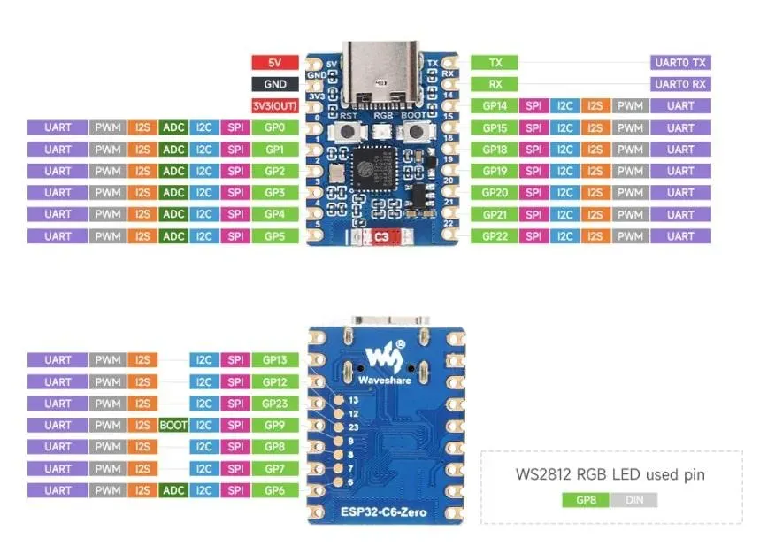

# Rust Embedded Demo

**Ziel:** Die ESP32-C6-DevBoards spielen eine Regenbogen-Animation über die Onboard-RGB-LED ab und synchronisieren sich über WiFi-Broadcast-Nachrichten mit anderen DevBoards in Funkreichweite.

Die Farbe im Farbspektrum wird durch eine `u16`-Variable repräsentiert. Da sowohl der minimale Wert `0` als auch der maximale Wert `u16::MAX = 65535` die Farbe Rot abbilden, ist ein Überlauf der Variablen erwünscht, um ein nahtloses, zyklisches Farbspektrum zu ermöglichen.


Wenn zwei DevBoards ihren aktuellen Farbton austauschen, können sie sich anhand der folgenden Regeln annähern und auf diese Weise synchronisieren:

- Liegt der empfangene Farbton im Spektrum voraus, wird die Animation leicht beschleunigt.
- Liegt der empfangene Farbton im Spektrum zurück, wird die Animation leicht verlangsamt.
- Stimmen eigener und empfangener Farbton überein, bleibt die Abspielgeschwindigkeit unverändert.

## Workspace

Im Workshop-Verzeichnis `3-Demo` befinden sich hilfreiche Code-Schnipsel, die dabei unterstützen, den Workshop in der vorgesehenen Zeit durchzuführen. Im Verlauf des Workshops werden diese Schnipsel schrittweise miteinander kombiniert, sodass am Ende eine Firmware mit der oben beschriebenen Funktionalität entsteht.

Den eigentlichen Code schreiben Sie in der Datei `3-Demo/src/lib.rs`.

## Aufgaben

### Entwicklungsumgebung einrichten

1. Schließen Sie das bereitgestellte DevBoard an Ihr Laptopn an.
2. *Nur Windows*: Weisen Sie dem USB-Gerät den richtigen Treiber zu:
   * [zadig](https://github.com/pbatard/libwdi/releases/download/v1.5.1/zadig-2.9.exe) starten
   * `Options` -> `List All Devices` aktivieren
   * `USB JTAG/serial debug unit (Interface 2)` aus der Liste auswählen
   * Der Button in der Mitte hat ein Drop-Down über das kleine Dreieck. Hier die Aktion `Install Driver` auswählen. Der Button verändert seine Beschriftung auf `Replace Driver`.
   * Die Aktion `Replace Driver` per Klick auf den Button ausführen
3. Öffnen Sie in VS Code ein Terminal im Pfad `3-Demo`.
4. `cargo run` ausführen. Der Code wird übersetzt, geflasht und zur Ausführung gebracht. `src/lib.rs` enthält den Code, der `"Hallo Workshop!"` ausgibt. Das Logging wird per `[Strg] + [C]` beendet.
5. `cargo doc` ausführen. Dieser Aufruf dokumentiert sämtlichen Code. Dieser Vorgang kann etwas Zeit in Anspruch nehmen, da auch alle zum Projekt gehörigen Libraries dokumentiert werden. Am Ende des Vorgangs wird ein Link angezeigt. Öffnen Sie diesen mit Ihrem Browser. (Hinweis für die Teilnehmer, die auf dem Code-Server arbeiten: Das Kommando `doc-link` gibt einen Link aus, den Sie mit Ihrem Browser öffnen können.)

### LED Blinky

Ziel dieser Übung ist die On-Board-LED zum Blinken zu bekommen.

Die vorherigen Kapitel geöffnete Dokumentation enthält das Modul `led`. Mit einem Klick darauf öffnet sich ein Beispiel-Code zum `Led`-Modul.

**Aufgabe 1-1:** Kopieren Sie den Code in die `src/lib.rs` unter Berücksichtung des Hinweises innerhalb der Datei, den oberen Teil unberührt zu lassen. Führen Sie den Code aus und prüfen Sie das Blinken der LED.

**Aufgabe 1-2:** Verändern Sie den Code, sodass das Blinken doppelt so schnell abläuft. Hinweis: Die `Duration` hat eine passende Methode, um Millisekunden anzugeben. Der Language-Server wird Ihnen helfen diese zu finden.

**Sonder-Aufgabe 1-3:** *... für die schnellen ...* Starten Sie die Animation erst, wenn der Taster **BOOT** auf dem DevBoard gedrückt wird. Gemäß der folgenden Pinout-Übersicht ist er an `GPIO9` angebunden. Der Dokumentation des DevBoards entnimmt man, dass der Taster den Pin auf GND zieht. Hinweise zur implementierung:
* `esp_hal::gpio::Input` ist ein geeingeter Treiber, um GPIOs einzulesen
* Der Pin muss als `Pull::Up` konfiguriert werden



### LED Regenbogen-Animation

Ziel dieser Übung ist die On-Board-LED eine Regenbogen-Animation ausführen zu lassen.

Die erzeugte Dokumentation enthält das Modul `rainbow`. Damit kann auf einer `Led` eine Regenboden-Animation dargestellt werden.

**Aufgabe 2-1:** Starten Sie die Animation durch den Aufruf von `rainbow::start_animation()` unter angabe passender Parameter. Hinweise: Das Argument `spawner` ermöglicht der Funktion einen eigenen Task für die Animation zu starten.

**Aufgabe 2-2:** Lassen Sie sich durch den `HueReporter`, den `start_animation()` zurück gibt, über die `defmt::info!()`-Logging-Methode den aktuellen Farbton zurück geben. Hinweise: Die Dokumenation vom `HueReporter` stellt eine `asnyc fn` dafür bereit. Um Werte daraus auszulesen, muss sie innerhalb einer Endlosschleife mit dem Zusatz `.await` aufgerufen werden.

### WiFi-Kommunikation

Ziel dieser Übung ist per WiFi Boardcast-Nachrichten zu senden und zu empfangen.

Die erzeugte Dokumentation enthält das Modul `net`. Dieses beinhaltet eine Demo für das Netzwerkmodul.

**Aufgabe 3-1:** Kopieren Sie die Demo (und sichern Sie bereits erzeugten Code in einem neuen Editor-Tab) und führen Sie sie aus. Sie sollten die Nachrichten der anderen Workshop-Teilnehmer sehen.

**Aufagbe 3-2:** Tun Sie sich mit 1-2 Ihrer Tischnachbar zusammen und vereinbaren Sie ein neues Secret. Senden Sie sich statt einer Zeichenkette eine Zahl zu. Hinweis: Das Modul kann beliebige Datentypen versenden und empfangen, solang sie über die `serde`-Crate serialisierbar bzw. deserialisierbar sind. Einzige Einschränkung: Alle Netzwerkteilnehmer müssen sich auf denselben Datentyp einigen.

### Zusammenbau der finalen Firmware

Die erarbeiteten Programm-Teile aus den vorherigen Kapiteln werden in diesem Kapitel zusammengefügt. Ziel ist es, dass alle DevBoards ihre Animation miteinadner synchroniseren.

**Aufgabe 4-1:** Anstatt feste Werte untereinander auszutauschen, sollen nun `HueReporter` und `HueAdjuster` aus der Animation aus *Aufgabe 2-2* miteinadner kommunzieren. Verändern Sie das Programm so, dass Werte aus dem `HueReporter` per `NetTX` ausgestrahlt werden. Werte, die per `NetRX` empfangen werden sollten dem `HueAdjuster` übergeben werden. Verwenden Sie für die Funk-Kommunikation das von der Workshop-Leitung vorgegebene Secret.

**Sonder-Aufgabe 4-2:** *... für die Kongress-Woche...* Lassen Sie Ihr Board laufen und schauen, ob Sie andere Kursteilnehmer in den Pausen anhand der Animation wiederfinden und einen Kaffee gemeinsame trinken :-)

<details>

Finale Firmware:

```rust
use embassy_futures::select::{Either, select};

/// Application ... this is your playground!
pub async fn main(spawner: Spawner, peripherals: Peripherals) {
    // Start RTOS
    rtos::start(peripherals.TIMG0, peripherals.SW_INTERRUPT);

    // Start network stack
    let key = b"Rust rocks!";
    let (net_rx, net_tx) = net::start_net::<u16>(&spawner, peripherals.WIFI, &key);

    // Start animation
    let led = led::Led::new(peripherals.SPI2, peripherals.GPIO8);
    let (hue_reporter, hue_adjuster) = rainbow::start_animation(&spawner, led);

    loop {
        match select(net_rx.recv(), hue_reporter.recv()).await {
            Either::First(hue) => {
                hue_adjuster.adjust(hue).await;
            }
            Either::Second(hue) => {
                net_tx.send(hue).await;
            }
        }
    }
}
```

</details>
